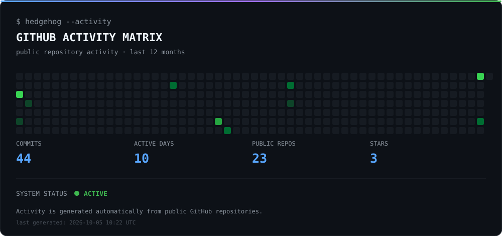

<p align="center">
  
</p>

<h2><code>$ whoami</code></h2>
<p>────────────────────────────</p>

<table>
<tr>
<td width="55%" valign="top">

**`aditya@github`**

Computer Science student at **Manipal University Jaipur**, building software, exploring systems, and learning how things work under the hood.

Interests:

- Cloud Computing
- Software Engineering
- Artificial Intelligence
- Open Source
- Linux & Developer Tooling

</td>
<td width="45%" valign="top">

```text
┌─────────────────────────────┐
│ SYSTEM PROFILE              │
├─────────────────────────────┤
│ User                        │
│  aditya-bobate              │
│                             │
│ Education                   │
│  B.Tech CSE                 │
│                             │
│ University                  │
│  Manipal University Jaipur  │
│                             │
│ Focus                       │
│  Cloud / Software / AI      │
│                             │
│ Status                      │
│  Building & Learning        │
└─────────────────────────────┘
```

</td>
</tr>
</table>

<h2><code>$ hedgehog --stack</code></h2>
<p>────────────────────────────</p>

<table>
<tr>
<td width="50%" valign="top">

**Languages**

- Python
- Java
- C++
- Go
- SQL

</td>
<td width="50%" valign="top">

**Development**

- OpenCV
- Tkinter
- HTML / CSS
- JavaScript
- TypeScript

</td>
</tr>
<tr>
<td width="50%" valign="top">

**Data & Testing**

- SQLite
- OpenPyXL
- Jest

</td>
<td width="50%" valign="top">

**Tools & Environment**

- Git / GitHub
- Linux
- AWS

</td>
</tr>
</table>

**Currently exploring:** Cloud Computing · DSA · System Design · AWS

<h2><code>$ hedgehog --projects</code></h2>
<p>────────────────────────────</p>

<table>
<tr>
<td width="50%" valign="top">

**Facetrack**
*Student Face Recognition Attendance System*

Real-time attendance system built with Python and OpenCV featuring role-based access, subject-wise attendance, SQLite persistence and Excel reporting.

`Python` `OpenCV` `LBPH` `Tkinter` `SQLite` `OpenPyXL`

<a href="https://github.com/aditya-bobate/Facetrack">
  
</a>

</td>
<td width="50%" valign="top">

**SatQuery AI**
*Satellite Imagery Analysis*

Satellite imagery analysis project developed as part of Smart India Hackathon.

`AI` `Python` `Satellite Imagery`

<a href="https://github.com/HarshitBanawal18122005/sih-satellite-project">
  
</a>

</td>
</tr>
<tr>
<td width="50%" valign="top">

**PatrolSOS**
*Network Health Monitoring*

Contributed network-health monitoring functionality with automated tests as part of an open-source software project.

`TypeScript` `Testing` `Network Monitoring`

</td>
<td width="50%" valign="top">

**go-webserver**
*Go Web Server*

A practical Go project exploring HTTP server fundamentals and backend development.

`Go` `HTTP` `Backend`

</td>
</tr>
</table>

<h2><code>$ hedgehog --learning</code></h2>
<p>────────────────────────────</p>

<table>
<tr>
<td width="50%" valign="top">

**Currently building**

- Cloud Computing
- Data Structures
- System Design
- Linux
- AWS

</td>
<td width="50%" valign="top">

**Next targets**

- Distributed Systems
- Backend Engineering
- DevOps
- Open Source
- Cloud Architecture

</td>
</tr>
</table>

<h2><code>$ hedgehog --achievements</code></h2>
<p>────────────────────────────</p>

<p align="center">
  <a href="https://holopin.io/@adityabobate">
    
  </a>
</p>

<h2><code>$ hedgehog --activity</code></h2>
<p>────────────────────────────</p>

<p align="center">
  
</p>

```text
┌─ GITHUB ACTIVITY ──────────────────┐
│                                    │
│  Repository work       ● active    │
│  Open source           ● active    │
│  Projects              ● building  │
│  Learning              ● ongoing   │
│                                    │
└────────────────────────────────────┘
```

<p align="center">
  <sub>Live activity tracked on the GitHub profile itself → <a href="https://github.com/aditya-bobate">github.com/aditya-bobate</a></sub>
</p>

```text
┌─ SNAPSHOT ─────────────────────────┐
│                                    │
│  Focus         Cloud / SWE / AI    │
│  Status        Building & Learning │
│  Stack         Python · Go · TS    │
│  Environment   Linux · Git · AWS   │
│                                    │
└────────────────────────────────────┘
```

<p align="center">
  <sub>Full stats visible on the GitHub profile → <a href="https://github.com/aditya-bobate">github.com/aditya-bobate</a></sub>
</p>

<h2><code>$ hedgehog --connect</code></h2>
<p>────────────────────────────</p>

<table>
<tr>
<td valign="top">

**Email**

adityabobate15@gmail.com

</td>
<td valign="top">

**GitHub**

<a href="https://github.com/aditya-bobate">github.com/aditya-bobate</a>

</td>
</tr>
</table>

<p align="center">

```text
┌──────────────────────────────────────────────────────────────┐
│  $ hedgehog --status                                         │
│                                                              │
│  ● ONLINE                                                    │
│                                                              │
│  Building systems. Learning continuously.                    │
└──────────────────────────────────────────────────────────────┘
```

</p>

<p align="center">
  <sub>Built with Markdown · SVG · GitHub · curiosity</sub>
</p>
